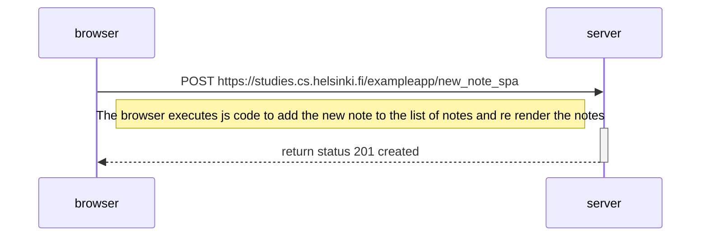

```mermaid
sequenceDiagram
    participant browser
    participant server

    browser->>server: POST https://studies.cs.helsinki.fi/exampleapp/new_note_spa
    Note right of browser: The browser executes js code to add the new note to the list of notes and re render the notes
    activate server
    server-->>browser: return status 201 created
    deactivate server


```
